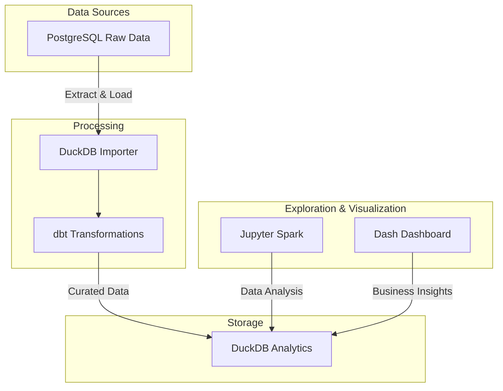

# Sales Data Analytics

An end-to-end data pipeline using **dbt**, **DuckDB**, **PostgreSQL**, **Spark**, and **Dash** to analyze sales performance.

## How to Run This Project

### 1️⃣ Prerequisites

Ensure you have the following installed:

- **Docker** & **Docker Compose** (>= 3.8)

### 2️⃣ Run the Project

To start all services, simply run:

```sh
docker-compose up --build
```

This will:

1. Spin up a **PostgreSQL** database and load sample data.
2. Execute the **DuckDB Importer** to process raw data.
3. Run **dbt** to create the analytical model.
4. Start a **Jupyter Notebook** with **Spark** for exploration.
5. Launch a **Dash dashboard** to visualize insights.
    - The **dashboard** will be available at: [http://localhost:8051](http://localhost:8051)
    - The **Jupyter Notebook** will be available at: [http://localhost:8888](http://localhost:8888)

To stop the project:

```sh
docker-compose down
```

---

## 🔄 Data Flow & Architecture

Below is a high-level overview of how data moves through the system.



### Pipeline Breakdown

1️⃣ **PostgreSQL** stores the raw sales data.  
2️⃣ **DuckDB Importer** extracts the data and loads it into DuckDB.  
3️⃣ **dbt** applies transformations, creating analytical tables.  
4️⃣ **DuckDB** stores the final **fact/dimension** tables.  
5️⃣ **Jupyter (with Spark)** allows data exploration and validation.  
6️⃣ **Dash Dashboard** visualizes key insights.  

---

## 📊 Data Model

We structured the data into **facts and dimensions**.

### 🔹 Staging Tables

These tables clean and prepare raw data:

- `stg_orders`
- `stg_customers`
- `stg_products`
- `stg_returns`
- `stg_locations`

### 🔹 Fact Tables

Contain measurable business events:

- `fact_orders`: Aggregated order-level metrics.
- `fact_order_items`: Line-item details for each order.

### 🔹 Dimension Tables

Provide descriptive attributes:

- `dim_customers`: Unique customer records.
- `dim_products`: Consolidated product information.
- `dim_location`: Geographic details.
- `dim_managers`: Sales managers and their performance.

### 📌 Why Star Schema?

We implemented a **Star Schema** to simplify analytical queries, improve performance, and ensure clear relationships between facts and dimensions.  
This approach makes aggregations, filtering, and joins **efficient**, leveraging columnar storage in DuckDB for fast analytics.

### 📌 Data Model Diagram

```mermaid
erDiagram
    %% Fact Tables
    fact_orders }|--|| dim_customers : "customer_sk"
    fact_orders }|--|| dim_location : "location_id"
    fact_orders }|--|| dim_managers : "manager_id"
    fact_orders }|--o| fact_order_items : "order_id"

    fact_order_items }|--|| dim_products : "product_sk"
    fact_order_items }|--|| fact_orders : "order_id"

    %% Dimension Tables
    dim_customers {
        string customer_sk
        string customer_id
        string customer_name
        string segment
    }
    
    dim_products {
        string product_sk
        string product_id
        string category
        string sub_category
        string product_name
    }

    dim_location {
        string location_id
        string country
        string city
        string state
        int postal_code
    }

    dim_managers {
        string manager_id
        string manager_name
    }

    fact_orders {
        string order_id
        date order_date
        date ship_date
        string ship_mode
        string manager_id
        string location_id
        string customer_sk
        float adjusted_sales
        float adjusted_profit
    }

    fact_order_items {
        string order_id
        string product_sk
        int quantity
        float unit_price
        float adjusted_sales
        float adjusted_profit
        float discount_amount
        float discount_rate
    }
```



---

### 🔍 **Data Quality & Integrity Checks**

We applied multiple data validation steps to ensure high-quality and consistent data:

✅ **Null & Orphan Record Handling**  

- Removed or corrected missing values to prevent data gaps.  
- Ensured foreign keys in fact tables reference valid dimension records.  

✅ **Duplicate Resolution**  

- Standardized `product_id` to prevent inconsistencies (same product, different names).  
- Validated unique `customer_id`, ensuring one-to-one relationships with names and segments.  

✅ **Geolocation Accuracy**  

- Verified that postal codes are **not duplicated** across different cities/states.  

✅ **Data Type Consistency**  

- Enforced strict data types to prevent errors in aggregations and joins.  

---

### 🔎 Key Modeling Considerations

✅ Ensured each `customer_id` has a single name and segment  
✅ Fixed `product_id` inconsistencies (same product, different names)  
✅ Validated **location uniqueness** (no duplicated postal codes)  
✅ Adjusted `fact_orders` to derive from `fact_order_items`  
✅ Removed `discount` due to inconsistencies

---

## 📈 Dashboard Insights

The **Dash dashboard** provides key sales metrics:

- 🛒 **Sales Trends** (Total Revenue & Profit Over Time)
- 🔄 **Return Rates** (Overall & Per Customer)
- 🏆 **Top Customers & Managers**
- 📦 **Order & Customer Metrics**
- 🚚 **Logistics Performance**

---

## 🛠 Development & Debugging

### To manually enter containers

```sh
docker exec -it dbt-container /bin/bash
```

### To run dbt transformations

```sh
dbt run
```

### To explore DuckDB

```sh
duckdb /db/analytics.duckdb
```
